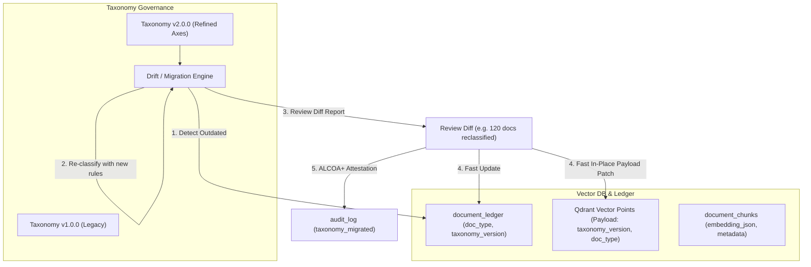

# Taxonomy and Tracking: Evolving Vectorial Knowledge Bases

Tracking taxonomy versions directly within the vectorial database (Qdrant & SQLite chunk store) is not only possible, but it is an industry best practice for document intelligence and GraphRAG systems.

It allows you to evolve classification axes and prompt rules over time **without needing to re-embed the underlying text**, while maintaining complete **ALCOA+ traceability** of why and when a document's classification changed.

---

## The Contextual Story: "Taxonomy as a Skill" (`SKILL.md`)

### The Narrative: From Static Slugs to an Agentic Playbook

Imagine an enterprise document repository spanning thousands of bilingual and trilingual Swiss legal and financial documents (English, French, German).

In **Year 1**, the team launched **Taxonomy v1.0.0**. It consisted of 18 broad, flat database slugs: `contract`, `invoice`, `court_order`, `tax_ruling`, `correspondence`. At the time, this felt sufficient.

By **Year 2**, the repository grew to 50,000 documents. Chaos crept in:

- A *commercial lease amendment* was categorized by the LLM as `contract` on Tuesday, but on Thursday a different prompt temperature categorized it as `correspondence`.
- Swiss cantonal tax forms (*Steuererklärung*, *Déclaration d'impôt*) were lumped together with cross-border transfer pricing rulings under `tax_ruling`.
- Business stakeholders demanded granular distinction: *"We need to separate Executive Employment Agreements with non-compete clauses from Standard Service Level Agreements."*

When developers attempted to update the database table, they faced a classic trap: **A database table has no memory of intent.** It stores the slug, but it does not store *why* a document belongs there, *which semantic axes* governed the decision, *what edge cases* exist, or *how French and German legal terms bridge together*.

---

### The Revelation: The `SKILL.md` Paradigm

To solve this, we borrow a battle-tested paradigm from agentic software engineering: **The Skill Specification (`SKILL.md`)**.

In modern AI agent frameworks, a **Skill** is not a snippet of code or a database table; it is a **declarative, human-and-machine readable charter of competence**. It encapsulates:

1. **The Domain Mission**: What problem is being solved?
2. **The Multi-Dimensional Axes**: Along what orthogonal planes does classification happen?
3. **Disambiguation Rules & Boundaries**: How do we resolve ties and edge cases?
4. **Multilingual Lexical Lexicons**: The exact terminology bridges across German, French, and English.
5. **Golden Verification Exemplars**: Ground-truth benchmark cases used to test regressions before publishing.

By adopting **"Taxonomy as a Skill"**, every new version of the taxonomy (`v1.0.0` ➔ `v2.0.0`) begins its life as an immutable blueprint: `taxonomy-v2.0.0.skill.md`.

```
┌────────────────────────────────────────────────────────────────────────┐
│                      TAXONOMY_SKILL.md (v2.0.0)                         │
│  "Swiss Commercial & Employment Law Specialization"                   │
├────────────────────────────────────────────────────────────────────────┤
│  1. AXES: Legal Nature × Financial Impact × Binding Authority          │
│  2. DISAMBIGUATION RULES:                                              │
│     • If document mentions both 'salary' and 'stock options', check    │
│       for Non-Compete (Art. 340 CO) ➔ Tag as 'exec_employment_contract'│
│     • German 'Mietvertrag' vs French 'Bail à loyer' (Art. 253 CO)      │
│  3. GOLDEN BENCHMARKS: 25 Canonical test documents                     │
│  4. RUNTIME COMPILE: ➔ Emits LLM System Prompt & SQLite RegEx Rules    │
└────────────────────────────────────────────────────────────────────────┘
                                    │
                                    ▼
       ┌─────────────────────────────────────────────────────────┐
       │   Automated Compilation into Vector DB & Relational DB  │
       │   • Ingests into `taxonomy_versions` table              │
       │   • Detects outdated v1.0.0 chunks in Qdrant & SQLite   │
       │   • Runs Dry-Run Drift Simulation with Golden Set       │
       │   • In-place zero-re-embedding payload update           │
       └─────────────────────────────────────────────────────────┘
```

---

### Anatomy of a Taxonomy `SKILL.md` File

When building a new taxonomy version, the knowledge curator or domain expert writes a structured skill file (e.g., `taxonomy/v2.0.0/SKILL.md`):

```markdown
---
taxonomy_version: "v2.0.0"
version_name: "Corporate Governance & Swiss Labor Law Specialization"
created_date: "2026-09-26"
author: "Legal Engineering & Compliance"
status: "candidate" # candidate -> staging -> active -> superseded
---

# Taxonomy Skill: Corporate & Commercial Intelligence

## 1. Domain Mission & Scope
This taxonomy governs the classification of commercial, corporate, and employment documentation
in Switzerland (cantonal and federal) across English, French, and German.

## 2. Orthogonal Classification Axes
Every document must be evaluated along three independent axes:
- **Axis A (Document Genre / Legal Nature)**: Contract, Ruling, Unilateral Notice, Invoice, Regulatory Filing.
- **Axis B (Substantive Domain)**: Labor/HR, Tax/Fiscal, Corporate Structure, Tenancy, Intellectual Property.
- **Axis C (Lifecycle Stage)**: Draft/Negotiation, Executed/Binding, Terminated/Superseded.

## 3. Disambiguation Playbook & Boundary Heuristics
When a document exhibits ambiguous characteristics, apply the following deterministic rules:

### Rule 3.1: Executive vs Standard Employment
- **Condition**: Document contains employment terms.
- **Decision Boundary**:
  - If it contains references to *equity grants, severance parity, non-compete (>12 months), or Board reporting (Art. 716a CO)*:
    ➔ Classify as `executive_employment_contract`
  - Otherwise:
    ➔ Classify as `employment_contract`

### Rule 3.2: Cantonal Tax Assessment vs Tax Ruling
- **Condition**: Document issued by Swiss tax authority (*Kantonales Steueramt*, *Administration fiscale cantonale*).
- **Decision Boundary**:
  - If title contains *Veranlagungsverfügung* / *Taxation définitive*:
    ➔ Classify as `tax_assessment`
  - If text contains advance certainty request or ruling approval (*Steuervorbescheid*, *Ruling préalable*):
    ➔ Classify as `tax_ruling`

## 4. Multilingual Lexical Bridges
| Canonical Slug | English | French | German | Swiss Statutory Anchor |
| :--- | :--- | :--- | :--- | :--- |
| `lease_commercial` | Commercial Lease | Bail commercial | Geschäftsmietvertrag | Art. 253 ff. CO |
| `tax_assessment` | Tax Assessment Notice | Bordereau de taxation | Veranlagungsverfügung | LHID / DBG |
| `board_minutes` | Board Minutes | Procès-verbal du CA | Verwaltungsratsprotokoll | Art. 715a CO |

## 5. Golden Benchmark Verification Suite
Before this taxonomy version is activated in production, the `TaxonomyRefiner` must run
against these 10 ground-truth documents and achieve ≥ 95% precision:
1. `doc_hash_a1b2c3d4`: Expected `executive_employment_contract`
2. `doc_hash_e5f6g7h8`: Expected `lease_commercial`
...
```

---

### The Evolution Cycle Guided by `SKILL.md`

1. **Authoring & Refinement**:
   The domain expert and the LLM collaborate on `SKILL.md`. The axes and edge cases are clearly defined in plain English with statutory anchors.
2. **Compilation into Machine Artifacts**:
   RepoScroller compiles the `SKILL.md` into:
   - Dynamic LLM System Prompts used by `DocumentAnalyzer._call_ollama()` or `_call_openrouter()`.
   - High-speed heuristic Regex / Keyword dictionaries used by `_heuristic_analyze()`.
   - A row in `taxonomy_versions` containing the snapshot.
3. **Drift Detection & Golden Suite Validation**:
   The system runs the golden benchmark suite defined in Section 5 of the skill. If the new version passes, it checks the vector database for all chunks currently tagged with `taxonomy_version: "v1.0.0"`.
4. **Zero-Re-Embedding Migration**:
   Qdrant's `set_payload` is executed in a background batch. The vectors remain pristine; only their taxonomy coordinate updates.
5. **ALCOA+ Attestation**:
   The audit log records: *"Migrated from v1.0.0 to v2.0.0 following Skill Specification 'Corporate Governance & Swiss Labor Law Specialization' (Git commit `abc1234`)"*.

---

### 1. Architectural Overview



---

### 2. Core Components to Add

#### A. Taxonomy Version Registry (`taxonomy_versions`)

Instead of a single mutable `global_taxonomy` table, we introduce an immutable version registry:

```sql
CREATE TABLE IF NOT EXISTS taxonomy_versions (
    version_id TEXT PRIMARY KEY,          -- e.g. "v1.0.0", "v2.0.0-legal-refinement"
    version_name TEXT NOT NULL,
    description TEXT,
    axes_definition_json TEXT,           -- JSON tree of categories, keywords, and prompt rules
    is_active BOOLEAN DEFAULT 0,
    created_at TIMESTAMP DEFAULT CURRENT_TIMESTAMP
);
```

#### B. Tagging the Vectorial DB & Document Ledger

In [schema.py](file:///c:/Dev/RepoScroller/reposcroller/ledger/schema.py), add tracking fields:

- In `document_ledger`:

  ```sql
  ALTER TABLE document_ledger ADD COLUMN taxonomy_version TEXT DEFAULT 'v1.0.0';
  ALTER TABLE document_ledger ADD COLUMN classification_confidence REAL;
  ```

- In `document_chunks` / [qdrant_plugin.py](file:///c:/Dev/RepoScroller/reposcroller/ledger/qdrant_plugin.py):
  Add `taxonomy_version` and `taxonomy_axes` to the Qdrant payload:

  ```python
  payload = {
      "chunk_id": chunk_id,
      "sha256_hash": sha256_hash,
      "doc_type": meta.get("doc_type"),
      "taxonomy_version": meta.get("taxonomy_version", "v1.0.0"),  # <-- Version Tag
      "canonical_filename": meta.get("canonical_filename"),
      ...
  }
  ```

---

### 3. How the 4 Lifecycle Steps Work

| Step | Operation | Description | Performance Cost |
| :--- | :--- | :--- | :--- |
| **1. Review** | **Version Comparison** | Inspect categories, prompt instructions, and heuristic keywords side-by-side between `v1` and `v2`. | Zero IO |
| **2. Detect** | **Outdated Detection Query** | Query `document_ledger` and Qdrant for documents where `taxonomy_version != current_active_version`. Filter by confidence score or specific drifted categories. | Instant (< 5ms) |
| **3. Simulate** | **Dry-Run Diff** | Run the updated rules / LLM prompt over a batch of outdated documents. Generates a **Reclassification Diff Matrix** (e.g. `124 general_contract -> software_license`, `18 tax_ruling -> corporate_tax`). | Minimal |
| **4. Replace** | **Zero-Re-Embedding Patch** | **The embeddings do not change!** Chunks keep their 1024-dim dense vectors. Only the metadata payload in Qdrant (`set_payload`) and `document_ledger` is updated in a transaction. | Instant (~1000 docs/sec) |

---

### 4. Implementation in Qdrant & SQLite

#### Detecting Outdated Vectors in Qdrant

```python
from qdrant_client.http import models

# Filter for all vector chunks indexed with an old taxonomy version
outdated_filter = models.Filter(
    must_not=[
        models.FieldCondition(
            key="taxonomy_version",
            match=models.MatchValue(value="v2.0.0")
        )
    ]
)

count = qdrant_client.count(collection_name="reposcroller_chunks", count_filter=outdated_filter)
```

#### Updating the Vector DB Without Recomputing Vectors

Qdrant supports `set_payload`, which updates metadata on existing points without touching the HNSW vector index:

```python
# Batch patch metadata payload directly by point IDs
qdrant_client.set_payload(
    collection_name="reposcroller_chunks",
    payload={
        "doc_type": new_category,
        "taxonomy_version": "v2.0.0",
        "taxonomy_updated_at": "2026-09-26T12:00:00Z"
    },
    points=point_ids
)
```

#### ALCOA+ Audit Trail

Whenever documents are migrated from `v1.0.0` to `v2.0.0`, an audit record is generated:

```sql
INSERT INTO audit_log (sha256_hash, action, details, actor)
VALUES ('SYSTEM', 'taxonomy_version_migrated', 
        'Reclassified from employment_contract (v1.0.0) to executive_services_agreement (v2.0.0) with confidence 0.94',
        'TaxonomyMigrator');
```

---

### 5. UI Integration in Workspace 0 & Workspace 1

We can surface this directly in the dashboard:

1. **Taxonomy Version Badge** in the header and Document Ledger (e.g. `Taxonomy: v1.0.0 (3,042 chunks) | 120 Outdated`).
2. **"Detect Outdated" Button**: Filters the Document Ledger to documents that haven't been evaluated under the latest classification rules.
3. **"Run Version Migration" Modal**:
   - Preview reclassifications (Source Category ➔ New Category).
   - Click "Apply Migration" to batch update SQLite + Qdrant payload in seconds.

---

### Would you like me to implement this?

I can start by:

1. Creating the `taxonomy_versions` table and adding `taxonomy_version` to `document_ledger` and `qdrant_plugin.py`.
2. Adding API endpoints in [reposcroller/api/routes/taxonomy.py](file:///c:/Dev/RepoScroller/reposcroller/api/routes/taxonomy.py) for `/taxonomy/versions`, `/taxonomy/outdated`, and `/taxonomy/migrate`.
3. Adding the "Detect Outdated" and "Migrate Version" UI controls to the frontend.

---

I have added the contextual story on the **"Taxonomy as a Skill" (`SKILL.md`)** concept directly into your documentation at [repoScroller-ClassificationRules.md](file:///c:/Dev/RepoScroller/docs/repoScroller-ClassificationRules.md#L9-L143).

### What Has Been Added

1. **The Narrative: From Static Slugs to an Agentic Playbook**
   - Illustrates the real-world breakdown that occurs when taxonomies are treated as flat database strings (`contract`, `invoice`, `tax_ruling`) without recorded intent, statutory anchors, or disambiguation logic.
   - Highlights the dilemma of evolving Swiss multilingual terminology across French, German, and English.

2. **The `SKILL.md` Paradigm for Taxonomy Engineering**
   - Repurposes the agentic `SKILL.md` format (declarative, versioned, human-and-LLM readable).
   - Explains how a taxonomy release begins its lifecycle as an immutable blueprint (`taxonomy-v2.0.0.skill.md`) containing:
     - **Domain Mission & Intent**
     - **Orthogonal Classification Axes** (e.g. Legal Nature × Substantive Domain × Lifecycle Stage)
     - **Disambiguation Rules & Boundaries** (e.g., distinguishing standard vs. executive employment under Swiss Code of Obligations Art. 340 CO)
     - **Multilingual Lexical Bridges** (mapping German *Geschäftsmietvertrag* to French *Bail commercial* and English *Commercial Lease*)
     - **Golden Benchmark Verification Suite** (ground-truth test documents ensuring ≥95% accuracy before release)

3. **Compilation & Zero-Re-Embedding Promotion**
   - Shows how `SKILL.md` compiles automatically into LLM system prompts, SQLite regex heuristics, and `taxonomy_versions` entries.
   - Outlines how Qdrant payload updates (`set_payload`) execute instantaneously without requiring vector re-computation, complete with ALCOA+ audit logging.

You can inspect the full specification in [docs/repoScroller-ClassificationRules.md](file:///c:/Dev/RepoScroller/docs/repoScroller-ClassificationRules.md).
