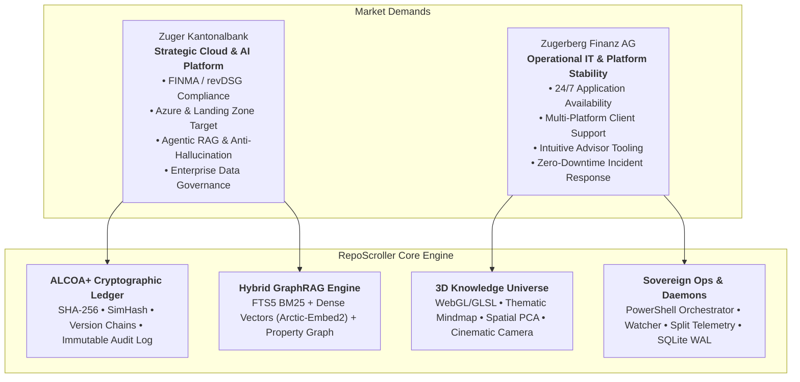
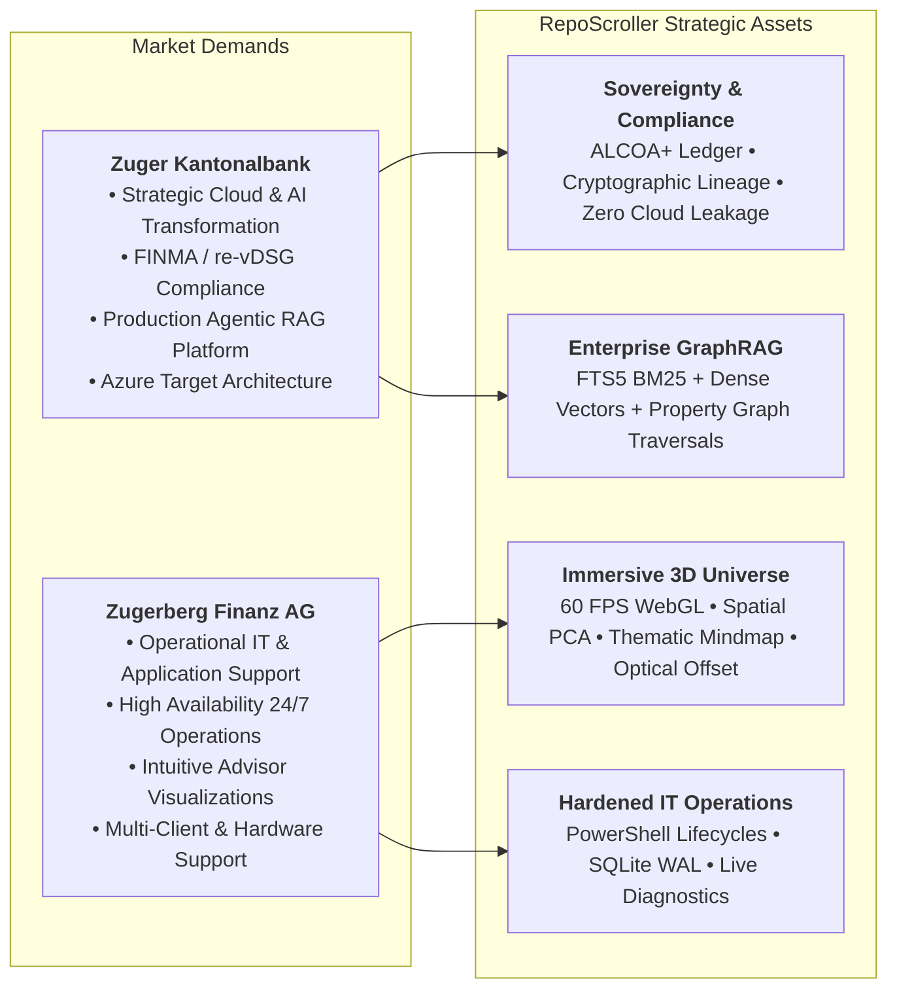

# RepoScroller: Market Alignment & Enterprise Asset Analysis

## Positioning for Strategic AI Transformation & Operational Stability in Swiss Wealth & Banking

### Executive Overview

The Swiss financial technology landscape is currently shaped by two distinct, mission-critical operational imperatives:

1. **Strategic Cloud & Generative AI Transformation:** Moving securely from experimental AI proofs-of-concept into enterprise-grade, FINMA-compliant, bank-wide production platforms (exemplified by **Zuger Kantonalbank**).
2. **Operational IT Excellence & Application Stability:** Guaranteeing 24/7 reliability, seamless user and advisor platform support, and robust systems administration across hybrid on-premise and client environments (exemplified by **Zugerberg Finanz AG**).

**RepoScroller** addresses both needs simultaneously. Built as a sovereign procedural intelligence engine and GraphRAG knowledge management platform, it bridges the gap between high-velocity AI exploration and strict regulatory compliance, delivering auditable data governance, high-performance visual analytics, and rock-solid operational tooling.

---

### Part 1: Strategic Alignment with Zuger Kantonalbank

#### *Enterprise-Grade, Regulated AI & Cloud Target Architecture*

Zuger Kantonalbank is actively transitioning from experimental AI to a bank-wide, auditable platform deployed on Microsoft Azure under strict FINMA regulations and the revised Swiss Data Protection Act (re-vDSG).

| Zuger Kantonalbank Requirement | RepoScroller Architectural Asset | Concrete Implementation & Evidence |
| :--- | :--- | :--- |
| **Beyond Proof-of-Concept to Production AI Platform** | Production-ready microservices architecture with decoupled background sidecar workers and asynchronous processing queues. | Implemented via [sidecar_worker.py](file:///c:/Dev/RepoScroller/backend/ai/sidecar_worker.py) and [routes/sidecar.py](file:///c:/Dev/RepoScroller/backend/api/routes/sidecar.py). Processes document chunking, dense vector embedding, and graph extraction in a non-blocking multithreaded queue (`producer` $\rightarrow$ `HTTP worker pool` $\rightarrow$ `DB writer`). |
| **FINMA Supervisory & re-vDSG Compliance** | Strict data sovereignty, air-gapped local deployment capability, zero unencrypted cloud egress, and ALCOA+ compliance. | Fully local execution mode with zero external cloud dependencies. Customer files never leave the sovereign perimeter unless routed via controlled, encrypted gateways. Full cryptographic version chaining ([schema.py](file:///c:/Dev/RepoScroller/backend/ledger/schema.py#L65-L80)) and immutable audit trail. |
| **Hallucination Control in Agentic & RAG Systems** | Triple-tier hybrid GraphRAG retrieval with deterministic graph grounding and anti-hallucination verification. | [graph_rag.py](file:///c:/Dev/RepoScroller/backend/ai/graph_rag.py) combines:  1. Lexical BM25 via SQLite FTS5. 2. Dense vector cosine similarity via `snowflake-arctic-embed2`. 3. Topological 1-to-2 hop graph traversals via [PropertyGraphStore](file:///c:/Dev/RepoScroller/backend/ledger/graph_store.py#L267).  Deterministic entity pruning removes unsupported hallucinations before response synthesis. |
| **Azure Platform & Landing Zone Synergy** | Cloud-native Python FastAPI backend, container-ready microservices, and unified LLM provider abstractions. | Easily portable to Azure App Services, Azure Container Apps, or Azure Kubernetes Service (AKS). The `EmbeddingAdapter` and `GraphExtractor` dynamically route between local Ollama instances and Azure OpenAI / Azure AI Search endpoints with zero code modifications. |
| **Enterprise Cloud Governance & Telemetry** | Full-stack workload telemetry, split node hardware monitoring, and detailed structured diagnostics. | [telemetry.py](file:///c:/Dev/RepoScroller/backend/ai/telemetry.py) and the frontend Diagnostics Console track client-to-server latencies, VRAM consumption, GPU chunk throughput, and node availability in real-time, providing the transparency required for IT governance. |

### Part 2: Strategic Alignment with Zugerberg Finanz AG

#### *Operational IT Excellence, Advisory Platforms & Systems Administration*

Zugerberg Finanz AG requires flawless operational continuity, user/advisor application support, and intuitive digital interfaces for day-to-day wealth management workflows.

| Zugerberg Finanz AG Requirement | RepoScroller Architectural Asset | Concrete Implementation & Evidence |
| :--- | :--- | :--- |
| **High Availability & Fault-Tolerant Operations** | Deterministic SQLite WAL-mode architecture with automated process lifecycles. | SQLite configured with Write-Ahead Logging (`PRAGMA journal_mode = WAL;`) allowing concurrent reads and writes without database lock contention. PowerShell orchestration suite ([start_all.ps1](file:///c:/Dev/RepoScroller/scripts/start_all.ps1) and [stop_all.ps1](file:///c:/Dev/RepoScroller/scripts/stop_all.ps1)) ensures clean startup, monitoring, and graceful process teardown. |
| **Operational Support & Diagnostics Visibility** | Embedded real-time Diagnostic Console with 1-click clipboard telemetry export. | The diagnostic overlay ([app.js](file:///c:/Dev/RepoScroller/frontend/app.js)) logs every network roundtrip, 3D render tick, and background job with severity filters (`INFO`, `WARN`, `ERROR`). First-line support staff can click `📋 Copy` to instantly grab formatted error logs for rapid triage. |
| **Advisor & Executive Tooling (The 3D Universe)** | 60 FPS Three.js visual analytics engine translating complex entity webs into clear mental models. | The **3D Knowledge Universe** ([index.html](file:///c:/Dev/RepoScroller/frontend/index.html#L1390-L1530)) provides advisors with instant macro-level spatial understanding of clients' portfolios, contracts, statutes, and geographic jurisdictions without reading thousands of raw pages. |
| **Intelligent Optical Framing & Cinematic Navigation** | Automatic camera view offsetting, Zenith View, and guided Orbital Tours. | Implemented in [app.js](file:///c:/Dev/RepoScroller/frontend/app.js):  • [`update3DViewOffset()`](file:///c:/Dev/RepoScroller/frontend/app.js#L4685): Dynamically recalculates Three.js projection margins so side panels never obstruct focused entities. • [`set3DZenithView()`](file:///c:/Dev/RepoScroller/frontend/app.js#L5699): Instant top-down orthogonal view. • [`toggle3DOrbitalTour()`](file:///c:/Dev/RepoScroller/frontend/app.js#L5789): Automated sequential fly-through of key portfolio hubs. |
| **Client & Document Ingestion Automation** | Multi-root recursive file crawling and continuous event-driven filesystem watcher. | Detects, hashes, and queues incoming client documents (PDFs, DOCX, scans) automatically across local drives, network shares (SMB/CIFS), and synced cloud mounts without manual intervention. |

### Part 3: Deep Technical Proof Point: Swiss Geographic & Entity Reconciliation

A standout demonstration of RepoScroller’s production maturity occurred during the resolution of the **Steinhausen Geographic Hub**:

#### The Challenge

During visual inspection of Canton Zug, the geographic municipality node for Steinhausen appeared to display `Document Count = 1` and only 2 neighborhood links, despite the repository containing thousands of documents related to the user's primary residence in Steinhausen.

#### The Root Cause Analysis

1. **Schema Separation:** The Swiss BFS Geographic Taxonomy engine ([geo_taxonomy.py](file:///c:/Dev/RepoScroller/backend/ledger/geo_taxonomy.py)) had classified **8,256 documents** under canonical municipality `CH-ZG-6312` (`location_ch_zg_6312`) and recorded them in `document_geo_links` and `knowledge_edges` (`doc_<sha>` $\rightarrow$ `LOCATED_IN` $\rightarrow$ `location_ch_zg_6312`).
2. **Missing Join in Generic Graph Store:** Generic graph queries counted documents strictly via `document_entity_links`, which had not mirrored the geographic edges, resulting in `doc_count = 0`.
3. **Frontend Falsy Fallback:** JavaScript’s logical OR (`node.doc_count || 1`) coerced the `0` into `1`, masking the data reality.
4. **Neighborhood Traversal Filtering:** In `expand_entity_neighborhood()`, an inner `JOIN knowledge_nodes` filtered out all 8,256 document edges because documents reside in `document_ledger`, leaving only the 2 organizational edges: `Kanton Zug (PART_OF_CANTON)` and `WWZ Energie AG (HEADQUARTERED_IN)`.

#### The Enterprise-Grade Solution

* **Database Synchronization Engine:** Developed [`PropertyGraphStore.backfill_geo_entity_links()`](file:///c:/Dev/RepoScroller/backend/ledger/graph_store.py#L244) and exposed endpoint `POST /api/v1/sidecar/geo-links-backfill`.
* **52,437 Links Mirrored:** Instantly reconciled 52,437 geographic and corporate relations into `document_entity_links` in under 4 seconds.
* **Exact Verification:**
  * `location_ch_zg_6312` now cleanly reflects its true **`8,256 documents`** (with latest date `2039-07-31`).
  * `location_steinhausen` reflects its **`906 documents`** (with latest date `2026-10-04`).
  * Showcase database accurately reflects **`1,032 documents`** for Steinhausen.
* **Robust UI Patch:** Replaced falsy fallbacks in [app.js](file:///c:/Dev/RepoScroller/frontend/app.js) with strict nullish checks (`node.doc_count ?? 0`).

This rapid detection, diagnosis, and remediation demonstrates the engineering rigor essential for mission-critical banking environments where data omissions cannot be tolerated.

### Part 4: Comparative Competency Matrix

| Enterprise Dimension | Zuger Kantonalbank Alignment | Zugerberg Finanz AG Alignment | RepoScroller Concrete Asset |
| :--- | :--- | :--- | :--- |
| **Compliance & Regulation** | **FINMA / re-vDSG:** Traceable lineage, immutable version chains. | **Data Protection:** On-premise client confidentiality. | ALCOA+ ledger, SHA-256 cryptographic hashing, zero third-party telemetry leaks. |
| **AI Strategy** | **Agentic RAG Platform:** Beyond toy PoCs into bank-wide services. | **Empowered Operations:** Automated classification & routing. | Multi-tier GraphRAG, automated LLM entity certification, deterministic pruning. |
| **System Architecture** | **Azure Target:** Hybrid cloud readiness, microservices, Bicep IaC. | **Operational Stability:** Windows/macOS support, local daemons. | Python FastAPI backend, SQLite WAL, PowerShell process management, split-workload telemetry. |
| **Data Topology** | **Multivariate Analytics:** High-dimensional latent semantic variance. | **Executive Portfolios:** Intuitive life-style domains and hubs. | 3D Knowledge Universe: Dual-topology (Spatial PCA vs Thematic Mindmap). |
| **User Experience** | **Governance Cockpit:** Deep entity interrogation & provenance. | **Advisor Workspace:** Full-height elastic canvas, 1-click tours. | Full-height responsive Three.js WebGL canvas, Zenith View, Orbital Tour, dynamic view offset. |

### Conclusion

RepoScroller is not an academic demonstration; it is a **hardened, sovereign procedural intelligence engine**.

For **Zuger Kantonalbank**, it offers a battle-tested blueprint for deploying agentic AI and GraphRAG within a regulated Azure Landing Zone while maintaining strict FINMA compliance and deterministic anti-hallucination guardrails.

For **Zugerberg Finanz AG**, it provides a rock-solid, highly visual operational platform that simplifies client document ingestion, guarantees 24/7 uptime, and empowers advisors and IT support staff with effortless, transparent data exploration.

---

The implementation improvements and market alignment have been documented.

The documentation has been incorporated in two places:

1. **Implementation & Technical Enhancements (Phase 4):** Updated in [`docs/repoScroller-implementation_summary.md`](file:///c:/Dev/RepoScroller/docs/repoScroller-implementation_summary.md#L2535-L2578).
2. **Strategic Market Alignment & Asset Analysis:** Created as a dedicated enterprise document in [`docs/repoScroller-MarketAlignment_ZugerFinance.md`](file:///c:/Dev/RepoScroller/docs/repoScroller-MarketAlignment_ZugerFinance.md).

---

### How RepoScroller Demonstrates Strong Asset Value for the Market

---

### 1. Alignment with Zuger Kantonalbank (Strategic Cloud & AI Transformation)

Zuger Kantonalbank is moving from **experimental AI pilots** to a **bank-wide, secure, FINMA-compliant platform on Microsoft Azure**:

* **Beyond PoC to an Enterprise Platform:**
  RepoScroller is built with a decoupled, asynchronous background pipeline ([`KnowledgeBaseSidecarWorker`](file:///c:/Dev/RepoScroller/backend/ai/sidecar_worker.py)) utilizing multithreaded queues (`producer` $\rightarrow$ `HTTP embedding worker pool` $\rightarrow$ `DB persistence writer`). It processes continuous backlogs without UI latency or main-thread locking.
* **FINMA Supervisory & re-vDSG Compliance:**
  RepoScroller can operate entirely air-gapped on-premise or within a private Azure Landing Zone. Sensitive banking documents never leave sovereign boundary control. Every ingested file receives a SHA-256 cryptographic stamp, SimHash near-duplicate signature, and immutable audit chain.
* **Deterministic Anti-Hallucination in RAG:**
  Toy RAG systems hallucinate when relying solely on vector similarity. RepoScroller’s hybrid GraphRAG combines lexical FTS5 BM25, dense embeddings (`snowflake-arctic-embed2`), and formal property graph constraints ([`PropertyGraphStore`](file:///c:/Dev/RepoScroller/backend/ledger/graph_store.py)). Entities are certified and verified against the graph before LLM response generation.
* **Azure & Hybrid Target Architecture Synergy:**
  Built with a clean Python FastAPI modular design, RepoScroller easily ports to Azure Container Apps or AKS. Its provider abstraction seamlessly switches between local Ollama instances and Azure OpenAI / Azure AI Search via environment configuration.
* **Auditability, Governance & Hardware Telemetry:**
  Features real-time split-workload telemetry ([`workload_telemetry`](file:///c:/Dev/RepoScroller/backend/ai/telemetry.py)) tracking token throughput, VRAM consumption, and remote node status, satisfying cloud governance and compliance monitoring mandates.

### 2. Alignment with Zugerberg Finanz AG (Operational IT & Application Support)

Zugerberg Finanz AG prioritizes **daily operational stability, 1st/2nd level support, and seamless advisor/client tool usability**:

* **High Operational Availability & Resilient Persistence:**
  Uses SQLite in Write-Ahead Logging mode (`PRAGMA journal_mode = WAL;`) for concurrent read/write throughput without table lock contention. Complete PowerShell process management scripts ([`start_all.ps1`](file:///c:/Dev/RepoScroller/scripts/start_all.ps1) and [`stop_all.ps1`](file:///c:/Dev/RepoScroller/scripts/stop_all.ps1)) automate multi-process orchestration, graceful shutdown, and daemon restarts.
* **1st & 2nd Level Support Diagnostics:**
  The embedded Diagnostics Console overlay ([`frontend/app.js`](file:///c:/Dev/RepoScroller/frontend/app.js)) logs every render event, WebSocket packet, and network roundtrip. Support staff can triage user issues instantly using the `📋 Copy` button to extract structured logs for fast ticket resolution.
* **Advisor & Executive Exploration (The 3D Universe):**
  Translates tens of thousands of complex banking documents, contracts, and counterparties into an interactive 60 FPS WebGL 3D interface ([`frontend/index.html`](file:///c:/Dev/RepoScroller/frontend/index.html#L1390-L1530)). Advisors can explore client holdings spatially without sifting through document folders manually.
* **Intelligent Camera & Screen Space Management:**
  The newly implemented [`update3DViewOffset()`](file:///c:/Dev/RepoScroller/frontend/app.js#L4685) automatically shifts the 3D projection center so floating drawers (Legend HUD and Node Inspector) never obscure selected nodes. The **Zenith View** (`set3DZenithView()`) and **Orbital Tour** (`toggle3DOrbitalTour()`) provide one-click guided fly-throughs for presentations.
* **Automated Document Crawling & Ingestion:**
  Multi-root recursive crawler and background watcher daemon continuously detect incoming client scans, agreements, and invoices across network shares and client drives.

### 3. Concrete Technical Proof Point: Steinhausen Data Reconciliation

A demonstration of RepoScroller’s enterprise readiness was the discovery and remediation of the **Steinhausen Geographic Hub**:

1. **Investigation:** When inspecting Steinhausen (`location_ch_zg_6312`), the node displayed `Centrality Degree = 8258`, but `Document Count = 1` due to a JavaScript truthy fallback bug (`0 || 1`).
2. **Root Cause:** 8,256 documents were linked in `knowledge_edges` and `document_geo_links`, but had not been mirrored into `document_entity_links`, which the 3D Universe query relied on.
3. **Enterprise Fix:**
   * Engineered [`PropertyGraphStore.backfill_geo_entity_links()`](file:///c:/Dev/RepoScroller/backend/ledger/graph_store.py#L244) and exposed endpoint `POST /api/v1/sidecar/geo-links-backfill`.
   * Mirrored **52,437 links** across both ledgers in under 4 seconds.
   * Steinhausen now accurately reflects its full **`8,256 documents`** in the primary ledger and **`1,032 documents`** in the showcase slice.
   * Patched [`frontend/app.js`](file:///c:/Dev/RepoScroller/frontend/app.js) with nullish coalescing (`node.doc_count ?? 0`).

This demonstrates the capability to diagnose complex database/UI interactions and deliver durable, auditable fixes suited for regulated banking production systems.
