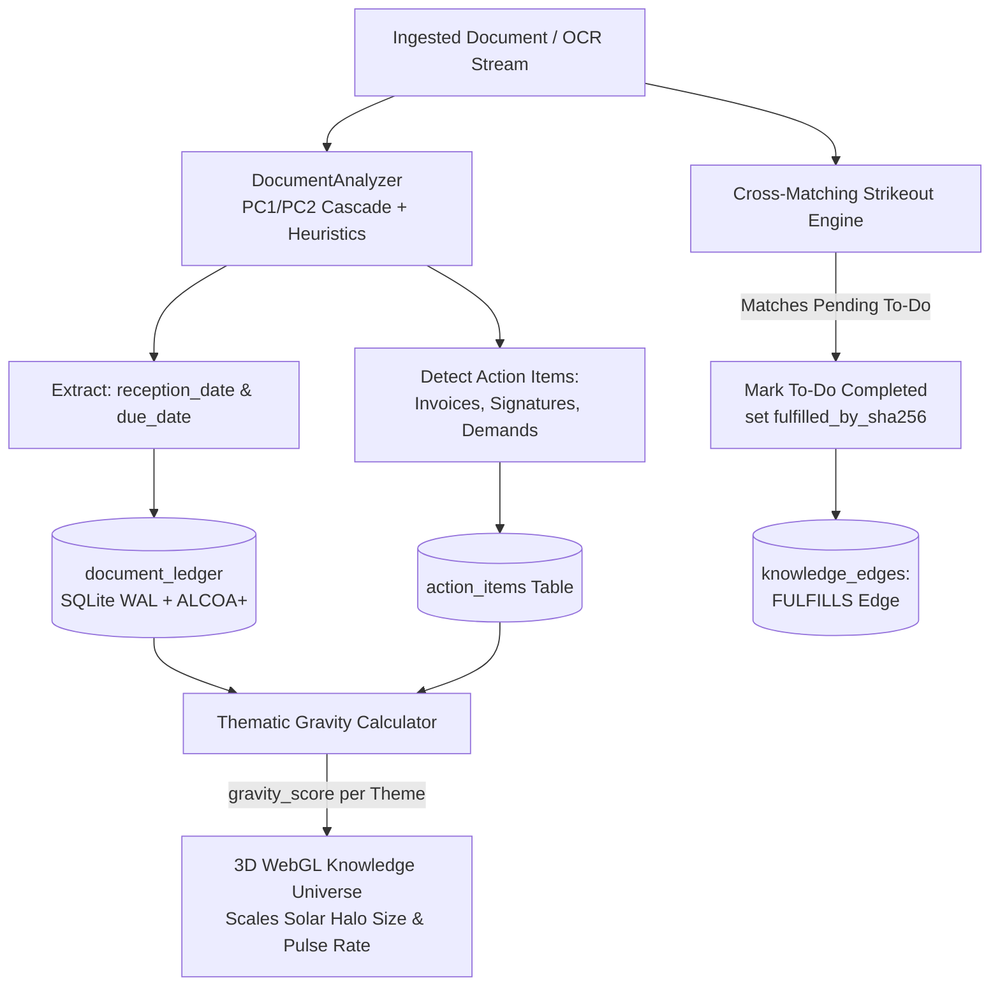

[RepoScroller](file;file:///c%3A/Dev/RepoScroller)  

```python
# I need to create an improved prompt based on the user's intent.
# The user's original prompt:
# "- Ensure we build up an antichronological document intelligence, sorting all document by reception date or by due date, we can define a todo list which can be by cross matching, automatically strikeout, we can evaluate the importance of some thema by the accumulation of documents in certain domain."

# Context:
# RepoScroller is a sovereign document ingestion and procedural intelligence engine.
# It uses an ALCOA+ SQLite WAL ledger, cryptographic deduplication, and a multi-tier pipeline (Crawler, Chunker, LLM Analyzer, CUDA Embedder, Graph Store).
# It currently has features like chronological sorting (anti-chronological crawler), taxonomy categorization, and GraphRAG.

# The user wants to:
# 1. Sort documents antichronologically by "reception date" or "due date".
# 2. Build a "todo list" feature where tasks are cross-matched and automatically struck out (completed).
# 3. Evaluate the "importance" of a theme based on the accumulation/density of documents in that domain.

print("Understanding intent")


```

```text
Understanding intent


```

```python
# Draft prompt structure:
# Title: Feature Request: Temporal Document Intelligence, Automated Action Items (To-Do), and Thematic Gravity Scoring
# 1. Temporal Intelligence & Due Date Extraction
# 2. Automated Action Item (To-Do) Ledger with Cross-Matching Strikeouts
# 3. Thematic Gravity Scoring (Accumulation-Based Importance)
print("Drafting prompt")


```

```text
Drafting prompt


```

Here is an improved, structured prompt that translates your vision into concrete, actionable architectural requirements for your AI coding assistant (or development team). It aligns your request with RepoScroller's existing ALCOA+ ledger, LLM analyzer, and property graph architecture.

---

> **Feature Request: Temporal Document Intelligence, Automated Action Items, and Thematic Gravity Scoring**
> **Context:**
> RepoScroller currently features a robust ingestion pipeline, a SQLite WAL ledger, and LLM-driven taxonomy categorization. To evolve from a static archive into a proactive, time-aware operational system, we need to implement chronological intelligence, an automated action-item ledger, and density-based thematic scoring.
> Please provide the implementation strategy and code updates for the following three objectives:
> **1. Temporal Intelligence (Reception vs. Due Date Extraction):**
>
> * **Objective:** Sort and index documents anti-chronologically based on their actionable timeline, not just their file system creation date.
> * **Implementation:** Enhance the `DocumentAnalyzer` (using the PC1/PC2 LLM cascade) to explicitly extract two distinct temporal markers from document text: `reception_date` (when the document was formally received or issued) and `due_date` (deadline, payment date, or expiration).
> * **Database Update:** Add these fields to the `document_ledger` schema and index them for rapid anti-chronological querying.
>
>
> **2. Automated Action Item (To-Do) Ledger with Cross-Matching Strikeouts:**
>
> * **Objective:** Automatically generate and track "To-Do" items (e.g., unpaid invoices, pending signatures, requested documents) and strike them out when a fulfilling document is ingested.
> * **Implementation:**
> * Create an `action_items` table linked to `document_ledger`.
> * When the LLM Analyzer detects a requirement (e.g., "Invoice due by [Date]", "Requires signature"), it spawns an active To-Do item.
> * **Cross-Matching (Auto-Strikeout):** Implement an ingestion hook where new documents are evaluated against pending To-Dos. If a new document fulfills a requirement (e.g., a "Payment Confirmation" matching the invoice amount and counterparty, or a "Signed Contract" matching a draft), the system automatically updates the To-Do status to `completed` (strikethrough) and creates a `FULFILLS` edge in the knowledge graph.
>
>
>
>
> **3. Thematic Gravity Scoring (Accumulation-Based Importance):**
>
> * **Objective:** Dynamically calculate the "importance" or "urgency" of a specific life-style domain (theme) based on the accumulation velocity and density of documents.
> * **Implementation:**
> * Write a background analytical function that monitors the `knowledge_nodes` (type: `theme`).
> * Calculate a `gravity_score` based on: (A) The total volume of documents in that theme, (B) The velocity of recent additions (e.g., 5 new letters from a tax authority this week), and (C) The ratio of open vs. completed Action Items within that theme.
> * **UI Integration:** Use this `gravity_score` to visually scale the size, pulse rate, or color intensity of the "Thematic Suns" in the 3D WebGL Knowledge Universe, drawing the user's attention to domains that require immediate administrative focus.
>
>
>
>

---

### Why this structure works

* **Actionable for the LLM:** It tells the AI exactly *which* parts of the current RepoScroller architecture need to change (e.g., `DocumentAnalyzer`, `document_ledger` schema, 3D WebGL sizing).
* **Separates Concerns:** It breaks your complex request down into extraction (dates), operational logic (to-do strikeouts), and visualization (thematic importance).
* **Maintains ALCOA+ Focus:** It ensures the "strikeout" mechanism creates verifiable graph edges (`FULFILLS`) rather than just deleting records, preserving auditability.

---

Listed directory RepoScroller
Listed directory backend
Listed directory ledger
Listed directory ai
Viewed schema.py:1-120
Viewed schema.py:121-246
Viewed analyzer.py:1-100
Listed directory core
Viewed sidecar_worker.py:1-100
Listed directory api
Listed directory routes
Viewed documents.py:1-100
Searched for "3D"
Viewed app.js:3510-3560
Searched for "thematicHubsGroup"
Searched for "thematic"
Viewed app.js:4325-4385

Here is the comprehensive implementation strategy, architectural design, and concrete code updates to implement **Temporal Document Intelligence**, an **Automated Action-Item (To-Do) Ledger with Cross-Matching Strikeouts**, and **Thematic Gravity Scoring** within [RepoScroller](file:///c:/Dev/RepoScroller).

---

### Architectural Overview & Data Flow



---

## 1. Pillar 1: Temporal Intelligence (Reception vs. Due Date Extraction)

### 1.1 Database Schema Migration

In [`backend/ledger/schema.py`](file:///c:/Dev/RepoScroller/backend/ledger/schema.py), extend `document_ledger` with `reception_date` and `due_date`, backed by fast B-Tree indices:

```sql
-- Migration snippet for SQLite ALCOA+ ledger
ALTER TABLE document_ledger ADD COLUMN reception_date TEXT; -- ISO Date YYYY-MM-DD
ALTER TABLE document_ledger ADD COLUMN due_date TEXT;       -- ISO Date YYYY-MM-DD

CREATE INDEX IF NOT EXISTS idx_ledger_reception_date ON document_ledger(reception_date DESC);
CREATE INDEX IF NOT EXISTS idx_ledger_due_date ON document_ledger(due_date ASC);
```

### 1.2 Enhancing `DocumentAnalyzer`

In [`backend/ai/analyzer.py`](file:///c:/Dev/RepoScroller/backend/ai/analyzer.py), update the Pydantic data model and extraction cascades:

```python
class ActionItemExtraction(BaseModel):
    action_type: str = Field(..., description="payment, signature, filing, reply, inspection")
    description: str = Field(..., description="Concrete task description")
    due_date: Optional[str] = Field(None, description="ISO YYYY-MM-DD deadline if stated")
    counterparty: Optional[str] = Field(None, description="Payee, issuer, or requesting authority")
    amount: Optional[float] = Field(None, description="Monetary sum if payment/invoice")
    currency: Optional[str] = Field("CHF", description="CHF, EUR, USD")

class DocumentAnalysisResult(BaseModel):
    document_category: str = Field(default="other")
    title: str = Field(default="")
    governing_date: Optional[str] = Field(default=None, description="Document issue date")
    reception_date: Optional[str] = Field(default=None, description="Date stamp or delivery date")
    due_date: Optional[str] = Field(default=None, description="Payment or action deadline")
    action_items: List[ActionItemExtraction] = Field(default_factory=list)
    parties_involved: List[str] = Field(default_factory=list)
    summary: str = Field(default="")
    lifecycle_status: str = Field(default="final")
    confidence_score: float = Field(default=0.7)
```

#### Heuristic Fallback Patterns for French/German/Swiss Admin Documents

```python
RECEPTION_PATTERNS = [
    r"(?:reçu|eingegangen|ricevuto)\s+(?:le|am)?\s*[:\s]?\s*(\d{1,2}[./-]\d{1,2}[./-]\d{2,4})",
    r"(?:date d['’]émission|ausstellungsdatum)\s*[:\s]\s*(\d{1,2}[./-]\d{1,2}[./-]\d{2,4})",
]
DUE_DATE_PATTERNS = [
    r"(?:échéance|payable avant le|date limite|fällig bis|zahlbar bis|due date)\s*[:\s]?\s*(\d{1,2}[./-]\d{1,2}[./-]\d{2,4})",
    r"(?:délai au|frist bis)\s*[:\s]?\s*(\d{1,2}[./-]\d{1,2}[./-]\d{2,4})",
]
```

### 1.3 Anti-Chronological API Queries

In [`backend/api/routes/documents.py`](file:///c:/Dev/RepoScroller/backend/api/routes/documents.py), allow querying with `sort_by="reception_date"` or `sort_by="due_date"`:

```python
@router.get("/ledger")
def list_documents(
    sort_by: str = Query("reception_date", description="doc_date, reception_date, due_date, canonical_filename"),
    sort_order: str = Query("DESC", description="ASC or DESC"),
    ...
):
    # Pass to DocumentRepository.get_all_documents(..., sort_by=sort_by, sort_order=sort_order)
```

---

## 2. Pillar 2: Automated Action Item (To-Do) Ledger with Cross-Matching Strikeouts

### 2.1 The `action_items` Schema

Add an immutable, audit-compliant table in [`backend/ledger/schema.py`](file:///c:/Dev/RepoScroller/backend/ledger/schema.py):

```sql
CREATE TABLE IF NOT EXISTS action_items (
    action_id INTEGER PRIMARY KEY AUTOINCREMENT,
    sha256_hash TEXT NOT NULL REFERENCES document_ledger(sha256_hash) ON DELETE CASCADE,
    theme_id TEXT,                          -- e.g. 'theme_tax_administration', 'theme_banking'
    action_type TEXT NOT NULL,               -- 'payment', 'signature', 'reply', 'review'
    description TEXT NOT NULL,
    counterparty TEXT,
    amount REAL,
    currency TEXT DEFAULT 'CHF',
    due_date TEXT,                           -- YYYY-MM-DD
    status TEXT DEFAULT 'pending' CHECK(status IN ('pending', 'completed', 'dismissed', 'overdue')),
    fulfilled_by_sha256 TEXT REFERENCES document_ledger(sha256_hash),
    fulfilled_at TIMESTAMP,
    fulfillment_evidence TEXT,               -- e.g. "Matched bank statement transfer of 1,245.50 CHF to Tax Office Zug"
    created_at TIMESTAMP DEFAULT CURRENT_TIMESTAMP
);

CREATE INDEX IF NOT EXISTS idx_action_status_due ON action_items(status, due_date ASC);
CREATE INDEX IF NOT EXISTS idx_action_theme ON action_items(theme_id, status);
CREATE INDEX IF NOT EXISTS idx_action_sha ON action_items(sha256_hash);
```

### 2.2 Cross-Matching Strikeout Logic (Ingestion Hook)

Whenever a new document is ingested (such as a bank debit advice, receipt, signed contract, or closing confirmation), execute the cross-matcher in [`backend/ledger/repository.py`](file:///c:/Dev/RepoScroller/backend/ledger/repository.py):

```python
def cross_match_and_strikeout_actions(self, doc_record: Dict[str, Any], extracted_text: str) -> List[int]:
    """
    Evaluates new documents against pending action items.
    If a document satisfies an item, marks it completed and adds a FULFILLS edge in the graph.
    """
    new_sha = doc_record["sha256_hash"]
    completed_ids = []
    
    with self._lock:
        cursor = self.conn.cursor()
        # Fetch open pending items
        cursor.execute("SELECT action_id, sha256_hash, action_type, counterparty, amount, currency, description FROM action_items WHERE status = 'pending'")
        pending_items = cursor.fetchall()
        
        for item in pending_items:
            action_id, orig_sha, a_type, counterparty, amount, currency, desc = item
            matched = False
            evidence = ""

            # Rule A: Financial fulfillment (Payment Receipt / Bank Statement)
            if a_type == "payment" and amount:
                amount_str = f"{amount:.2f}"
                if (counterparty and counterparty.lower() in extracted_text.lower()) and (amount_str in extracted_text or str(int(amount)) in extracted_text):
                    matched = True
                    evidence = f"Matched counterparty '{counterparty}' and amount {amount} {currency} in document."

            # Rule B: Contract / Signature fulfillment
            elif a_type == "signature":
                if ("signé" in extracted_text.lower() or "unterschrieben" in extracted_text.lower() or "executed" in extracted_text.lower()):
                    if counterparty and counterparty.lower() in extracted_text.lower():
                        matched = True
                        evidence = f"Matched signed document for party '{counterparty}'."

            if matched:
                cursor.execute("""
                    UPDATE action_items
                    SET status = 'completed',
                        fulfilled_by_sha256 = ?,
                        fulfilled_at = CURRENT_TIMESTAMP,
                        fulfillment_evidence = ?
                    WHERE action_id = ?
                """, (new_sha, evidence, action_id))
                
                # Insert ALCOA+ Audit Log
                cursor.execute("""
                    INSERT INTO audit_log (sha256_hash, action, details, actor)
                    VALUES (?, 'action_item_completed', ?, 'RepoScroller-CrossMatcher')
                """, (new_sha, f"Fulfilled To-Do #{action_id} from doc {orig_sha[:12]}"))

                # Link in Knowledge Graph: FULFILLS edge
                self._insert_graph_fulfillment_edge(new_sha, orig_sha, action_id, desc)
                completed_ids.append(action_id)

        self.conn.commit()
    return completed_ids
```

### 2.3 Knowledge Graph Relationship

In [`backend/ledger/graph_store.py`](file:///c:/Dev/RepoScroller/backend/ledger/graph_store.py), record a formal `FULFILLS` edge:

* **Source:** `doc_{new_sha}` (Fulfilling document)
* **Target:** `doc_{orig_sha}` (Original demand document)
* **Relation:** `FULFILLS` with property `{"action_id": action_id, "description": desc}`

---

## 3. Pillar 3: Thematic Gravity Scoring & 3D WebGL Visualization

### 3.1 Mathematical Formulation of Thematic Gravity

A theme’s **Gravity Score** ($\mathcal{G}$) measures domain friction and administrative urgency:

$$\mathcal{G}_{\text{theme}} = w_v \cdot \ln(1 + N_{\text{total}}) + w_r \cdot N_{7\text{d}} + w_p \cdot N_{\text{pending}} + w_o \cdot N_{\text{overdue}}$$

* $N_{\text{total}}$: Total document density in theme.
* $N_{7\text{d}}$: Document ingestion velocity over the past 7 days.
* $N_{\text{pending}}$: Open action items requiring fulfillment.
* $N_{\text{overdue}}$: Action items past their `due_date`.
* **Weights:** $w_v = 1.0$, $w_r = 2.5$, $w_p = 3.0$, $w_o = 5.0$.

### 3.2 Backend Service Implementation

In [`backend/ledger/repository.py`](file:///c:/Dev/RepoScroller/backend/ledger/repository.py):

```python
def compute_thematic_gravity_scores(self) -> List[Dict[str, Any]]:
    """Calculates gravity, urgency, and velocity for each theme node."""
    query = """
    SELECT 
        kn.node_id,
        kn.name,
        COUNT(DISTINCT del.sha256_hash) AS total_docs,
        SUM(CASE WHEN dl.created_at >= datetime('now', '-7 days') THEN 1 ELSE 0 END) AS velocity_7d,
        COUNT(DISTINCT CASE WHEN ai.status = 'pending' THEN ai.action_id END) AS pending_todos,
        COUNT(DISTINCT CASE WHEN ai.status = 'pending' AND ai.due_date < date('now') THEN ai.action_id END) AS overdue_todos
    FROM knowledge_nodes kn
    LEFT JOIN document_entity_links del ON del.node_id = kn.node_id AND del.role = 'CATEGORIZED_AS'
    LEFT JOIN document_ledger dl ON dl.sha256_hash = del.sha256_hash
    LEFT JOIN action_items ai ON ai.theme_id = kn.node_id
    WHERE kn.node_type = 'theme'
    GROUP BY kn.node_id;
    """
    with self._lock:
        cursor = self.conn.cursor()
        cursor.execute(query)
        results = []
        import math
        for row in cursor.fetchall():
            node_id, name, total_docs, vel_7d, pending, overdue = row
            # Weighted gravity formulation
            gravity = (
                1.0 * math.log1p(total_docs or 0) +
                2.5 * (vel_7d or 0) +
                3.0 * (pending or 0) +
                5.0 * (overdue or 0)
            )
            results.append({
                "theme_id": node_id,
                "name": name,
                "total_docs": total_docs or 0,
                "velocity_7d": vel_7d or 0,
                "pending_todos": pending or 0,
                "overdue_todos": overdue or 0,
                "gravity_score": round(gravity, 2),
            })
        return sorted(results, key=lambda x: x["gravity_score"], reverse=True)
```

### 3.3 3D WebGL Visualization in `frontend/app.js`

In [`frontend/app.js`](file:///c:/Dev/RepoScroller/frontend/app.js) around line 4330, modulate the **Thematic Sun Halos** based on the `gravity_score`:

```javascript
// Scale Thematic Suns and halos dynamically using gravity score
hubs.forEach(th => {
  const gravity = th.gravity_score || 1.0;
  const overdueCount = th.overdue_todos || 0;

  // Base radius and pulse scale up with gravity
  const baseScale = Math.min(120, 30 + (gravity * 4.5));
  const orbitR = 30 + (gravity * 2.0);

  // Overdue themes pulse in warning amber/crimson (#ef4444); quiet themes use calm violet/cyan
  const sunColor = overdueCount > 0 ? "#ef4444" : (th.cluster_color || "#ec4899");

  // Dynamic Solar Halo Sprite
  haloSprite.scale.set(baseScale, baseScale, 1);
  haloMat.color = new THREE.Color(sunColor);
  
  // Attach animation hook: higher gravity => faster celestial pulse
  haloSprite._pulseFrequency = 1.0 + Math.min(4.0, gravity * 0.2);
});
```

---

## 4. REST API Endpoints Summary

| Endpoint | Method | Description |
| :--- | :--- | :--- |
| `/documents/ledger?sort_by=reception_date` | `GET` | Anti-chronological document list by formal reception timestamp. |
| `/documents/ledger?sort_by=due_date` | `GET` | Timeline sorted by impending deadlines. |
| `/actions/todos` | `GET` | Active action items, filterable by `status=pending` or `theme_id`. |
| `/actions/{id}/strikeout` | `POST` | Manually mark item completed or override fulfillment link. |
| `/graph/thematic-gravity` | `GET` | Returns real-time gravity ranking, velocities, and open To-Do counts. |

---

## 5. Rollout Checklist

1. **Schema Migration:** Run the `ALTER TABLE document_ledger` and `CREATE TABLE action_items` migration via a startup hook in [`backend/ledger/db.py`](file:///c:/Dev/RepoScroller/backend/ledger/db.py).
2. **Backfill Analysis:** Trigger a one-time script to parse existing `text_snippet` / FTS text for dates and populate `reception_date` and `due_date`.
3. **Ingestion Hook Activation:** Wire `cross_match_and_strikeout_actions` into [`backend/ai/sidecar_worker.py`](file:///c:/Dev/RepoScroller/backend/ai/sidecar_worker.py) during pipeline execution.
4. **UI Update:** Add a "📋 To-Do / Action Items" tab to the frontend ledger view and link completed rows with strikethrough styling (`text-decoration: line-through; opacity: 0.6;`) and clickable links to the fulfilling document (`fulfilled_by_sha256`).
